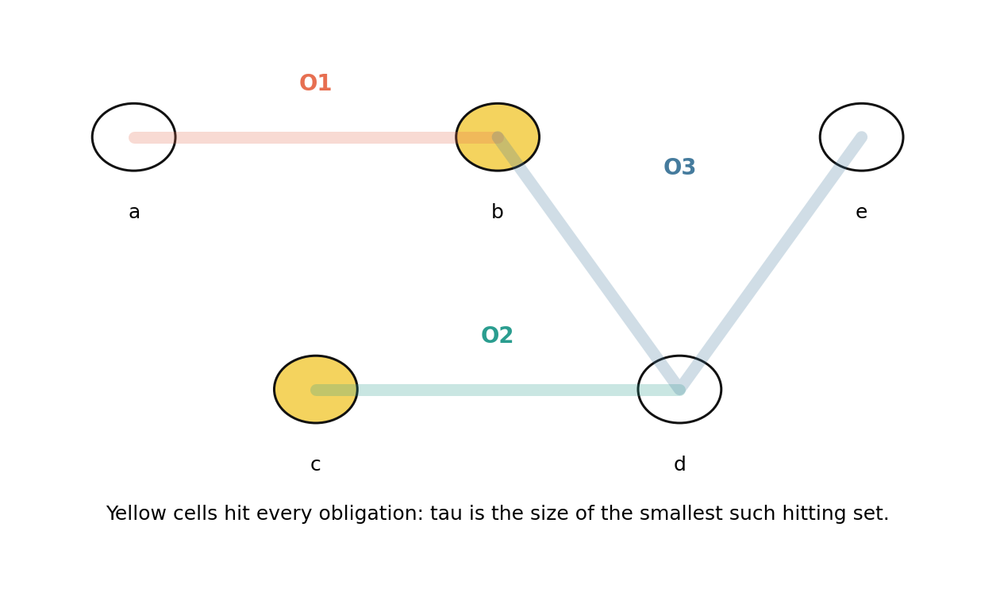
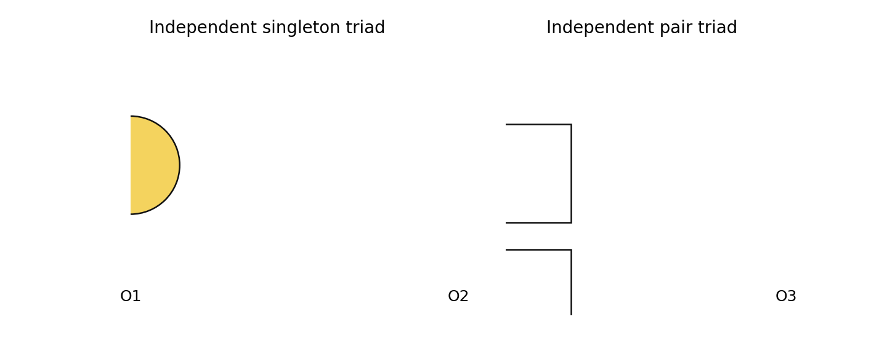
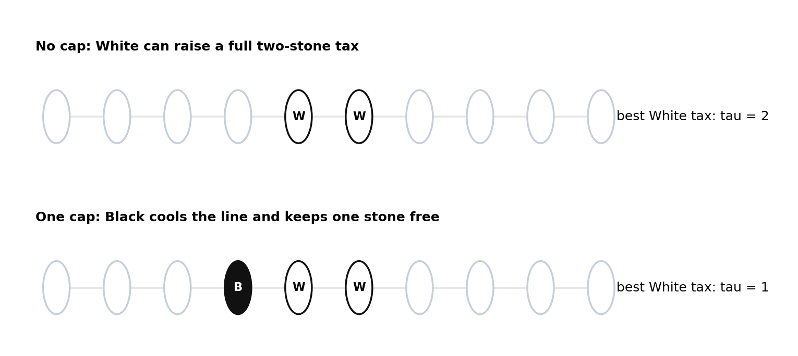
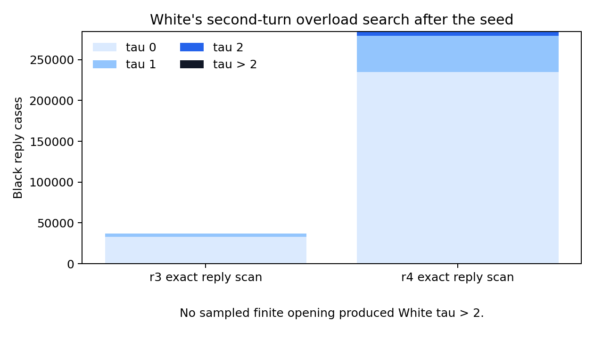
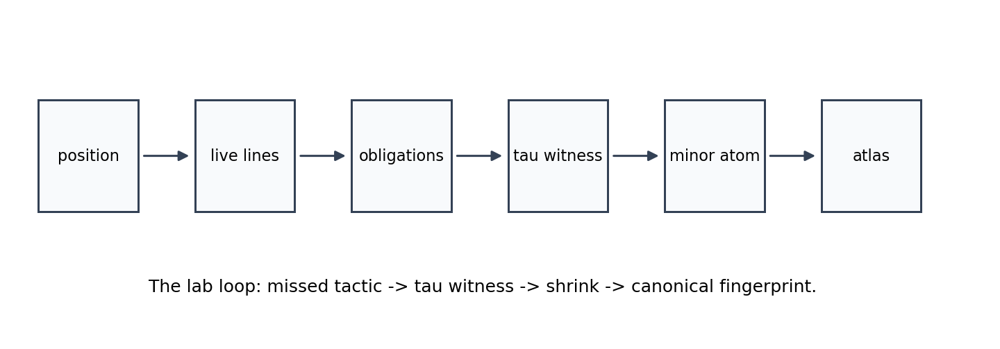
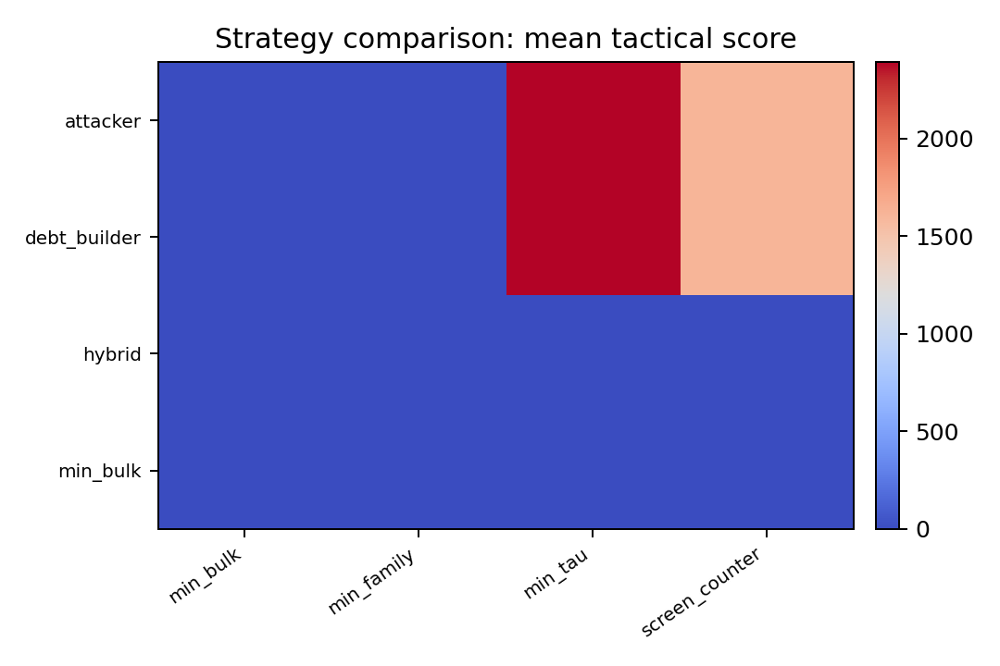
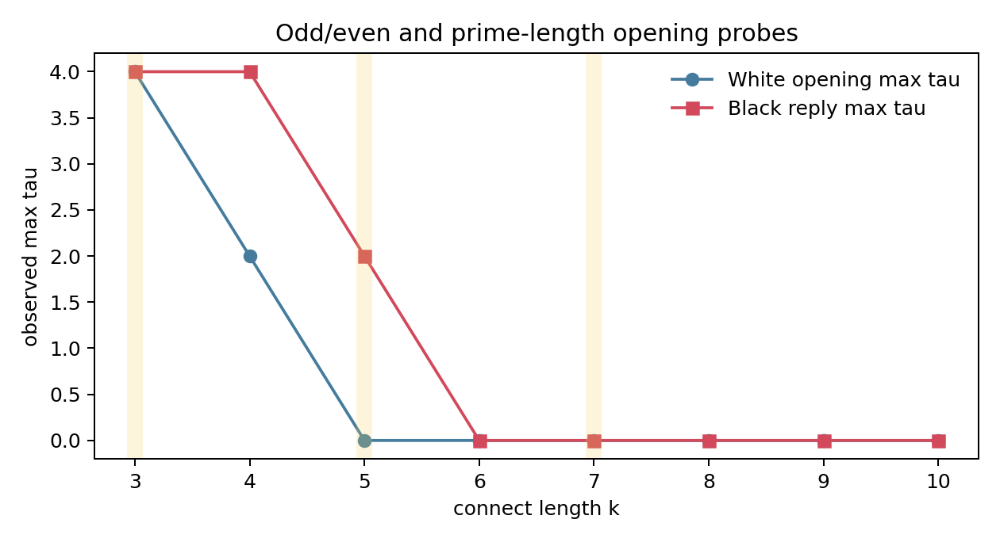

# The Little Book of Seeded Connect6

## A playful laboratory monograph on rooted Hex, obligations, atoms, and budget symmetry

This is a working theory book for the Connect6 lab. It is written as a playbook rather than a finished paper: positions get names, diagrams carry the burden, and conjectures are allowed to stand where the proofs are still being hunted.

The main claim is simple enough to fit on a slate:

```text
Seeded Hex Connect6 is a rooted progression-hypergraph game.
The visible stones are only the surface.
The tactical state is the live obligation hypergraph.
The opening question is whether Black's one-stone seed defect leaks through the later two-stone budget symmetry.
```

Our current answer is:

```text
The defect survives as a quiet resource leak, not as an immediate shallow win.
```

## 1. The Board That Is Not The Board

Normal Hex Connect6 is played on the A2 hex lattice. In axial coordinates the board cells are pairs `(q, r)`, and the three line directions are `(1, 0)`, `(0, 1)`, and `(1, -1)`. A player wins by occupying six consecutive cells on one of those lines.


*The rooted A2 board: the seed destroys translation symmetry but leaves a D6 stabiliser.*

The first move is the unusual move: Black places one stone. After that both players place two stones per turn. The game therefore begins with a defect, then immediately puts both players on equal budget. That is the source of the central tension.


*A length-6 progression is a winning hyperedge.*

The right object is not the board graph. It is the hypergraph of winning progressions:

```text
H = {x, x+d, x+2d, x+3d, x+4d, x+5d}
```

where `d` ranges over the three Hex directions.

## 2. Obligations

For a live line `L`, write:

```text
b_L = number of Black stones on L
w_L = number of White stones on L
e_L = empty cells of L
```

If `w_L = 0` and `0 < |e_L| <= 2`, then `e_L` is an urgent Black obligation: White must hit it immediately or Black can complete the line next turn.

So the position produces a family of missing-cell sets:

```text
O = {missing cells of each urgent line}
```

White's local survival question is not "how many threats are there?" It is:

```text
What is tau(O), the smallest number of cells that hits every obligation?
```

For Connect6 the defender has budget `p = 2`, so the local forcing threshold is:

```text
tau(O) > 2
```



*Obligations form a small hitting problem; tactics live in the transversal, not the threat count.*

## 3. Threats Are Not Numbers

The first trap in this game is counting threats as if they were coins. Three threats may be harmless if one stone blocks all of them. Two threats may be decisive if they are badly separated and the defender is short of tempo.

Two small positions deserve names:



*Two primitive bills: singleton and pair triads both force tau = 3 against a two-stone defender.*

The moral:

```text
raw threat count != tactical force
transversal structure = tactical force
```

A forcing atom is a minor-minimal obligation family with `tau(O) > p`. The word "minor" matters: if a smaller subfamily already forces, the larger object is decoration. The atom is the part that actually bites.

## 4. The Seed Defect

The 1-2-2 rule is usually introduced as a balancing patch. The hypergraph view makes it stranger. Black's first stone breaks translation symmetry forever:

```text
A2 semidirect D6  ->  D6
```

White can restore material count, but White cannot unroot the game.

This gives the defect-vs-budget question:

```text
Does White's two-stone budget wash out the seed,
or can Black keep converting the seed into rooted obligation debt?
```

The opening probes suggest a middle answer. The seed does not produce a quick certified win. But the equal budget does not create exact symmetry either.

## 5. The Toll Gate: One-Cap Cooling

The smallest useful cartoon is one-dimensional. Suppose White has an adjacent pair on a length-6 line. If Black ignores it, White can spend two stones to raise a full two-stone tax. If Black places one adjacent cap, White's best line tax drops to one.



*One-cap cooling: Black spends one stone to reduce White's next line tax from tau = 2 to tau = 1.*

This is the current best name for the phenomenon:

```text
one-cap cooling
```

It explains why the defect survives quietly. Black can often spend one stone to cool White's even-budget local threat while investing the other stone into rooted debt. That is not a proof of a win. It is a resource leak.

### Puzzle 1

White has stones at `0` and `1` on a length-6 line. Black may place one cap at `-1` or `2`. What is White's strongest two-stone continuation after each cap? What changes if Black places no cap?

Answer in the lab notes: no cap permits a full `tau = 2` tax; one cap cools the line to `tau = 1`; two caps kill that line but spend Black's whole move.

## 6. Opening Evidence

The finite searches were not proofs of the infinite game. They were microscopes aimed at the seed-budget interaction.

The exact reply scans found:

```text
radius 3: tau 0 = 33111, tau 1 = 3915, tau 2 = 0, tau > 2 = 0
radius 4: tau 0 = 234708, tau 1 = 44304, tau 2 = 5304, tau > 2 = 0
```



*White's early overload search: the scans found taxes, not overloads.*

The radius-3 tablebase corpus contains `66` canonical openings. W/L/U counts: `U: 66`. Final classes: `black_bulk_edge: 36, screened_or_balanced: 30`. The largest estimated naive tree in that corpus was `93196` leaves before pruning.

The important reading is not "Black is proven winning." It is:

```text
White does not appear to get an immediate tau > 2 symmetry-restoring overload.
Black's problem is therefore quiet debt building, not shallow tactical conversion.
```

## 7. Atoms Of Play

The atom programme asks a Conway-style question:

```text
What are the indivisible local games?
```

For this lab, an atom is a minor-minimal obligation family where `tau(O) > p`. It has an abstract form and a geometric realisation.



*The atom-mining loop turns zone failures into canonical forcing witnesses.*

The current rich atom corpus has `569` geometric rows. The most common named families include: `C5 pair atom: 557, K4 pair atom: 12`. The mean observed integrality gap is `0.511`.

Especially interesting are atoms where:

```text
tau(O) > p but tau*(O) <= p
```

Those are discrete tactical effects invisible to smooth density heuristics.

## 8. Strategy Families

The self-play runner is not a perfect-play oracle. It is a way to compare temperaments. Some strategies try to maximise bulk pressure. Some minimise the opponent's obligations. Some screen first. Some chase atom load.



*Strategy families compared by mean tactical score in the radius-3 self-play grid.*

The current radius-3 strategy grid ran `128` games: Black wins `0`, White wins `6`, undecided `122`.

This supports the earlier observation that optimal-looking Black and White play may be structurally different. Black wants rooted debt and branching. White wants cooling, screening, and budget denial.

## 9. Odd, Even, Prime

Changing the connect length `k` changes the rhythm. The naive slogan is:

```text
even k gives White more natural budget symmetry
odd k leaves Black closer to the tempo edge
```

The data is still small, but it is already useful as a diagnostic.



*Connect-k sweep: prime and odd/even lengths as rhythm probes, not final theorems.*

| k | parity | prime | tempo owner | White max tau | Black reply max tau |
|---|---|---|---|---|---|
| 3 | odd | True | black | 4 | 4 |
| 4 | even | False | white | 2 | 4 |
| 5 | odd | True | black | 0 | 2 |
| 6 | even | False | white | 0 | 0 |
| 7 | odd | True | black | 0 | 0 |
| 8 | even | False | white | 0 | 0 |
| 9 | odd | False | black | 0 | 0 |
| 10 | even | False | white | 0 | 0 |

Connect-3 is almost too hot: it behaves like an immediate tactical fire. Connect-4 begins to look like a game. Connect-6 is in the interesting middle, where the seed matters but does not simply explode.

## 10. The Unproved Kingdom

The current lab result can be stated cautiously:

```text
Defect-vs-budget symmetry is leaky.
The seed survives as a resource asymmetry.
Finite opening probes find no immediate White tau > 2 overload.
One-cap cooling explains how Black can spend one stone defensively and keep one stone for rooted debt.
```

What is not proved:

- Black has not been certified to win infinite Hex Connect6.
- The finite radius tablebases are not complete infinite-board certificates.
- Boundary effects can exaggerate one-sided caps.
- The spectral and atom pictures are strong organising hypotheses, not replacement proofs.

The next theorem target is a resource ledger:

```text
required Black cooling stones
versus
free Black debt-building stones
versus
White's ability to split independent obligations
```

### Conjecture A: One-Cap Cooling Lemma

In the length-6 line abstraction, one adjacent Black cap reduces a White adjacent-pair continuation from a full-budget `tau = 2` tax to a `tau = 1` partial tax.

### Conjecture B: Defect Leakage

In infinite Hex Connect6, the rooted seed allows Black to repeatedly cool local even-budget threats with one stone while using the other stone to accumulate rooted obligation debt, unless White can force independent obligations faster than Black can cool them.

### Conjecture C: Atom-Preserving Relevance

A relevance zone is strategically valid only when it preserves the minor-minimal `tau > p` atoms reachable at the searched depth.

### Puzzle 2

Find the smallest A2 position where White's best reply is not to block the largest apparent Black threat, but to block a lower-count obligation that prevents a future atom. That is the sort of position a threat counter misses and an obligation atlas should catch.

## Coda

This book is deliberately unfinished. Its job is to make the game easier to think with. The next edition should add:

- certified outside-slack proof trees,
- a table of named atoms,
- boundary-shadow diagrams,
- spectral mode cartoons,
- and a small gallery of opening positions classified by the resource ledger.

The rule of thumb for the lab remains:

```text
Do not count threats.
Count the cheapest way to hit them.
Then ask who paid the bill.
```
